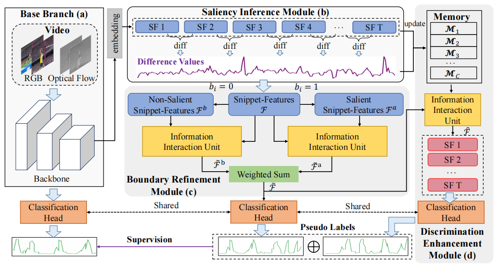
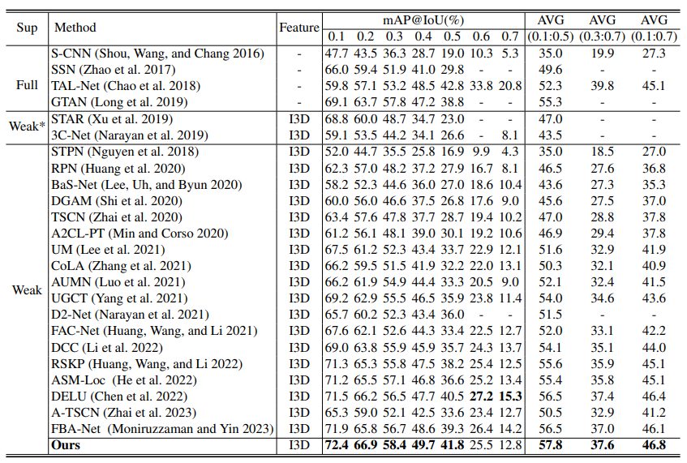

<div align="center" style="font-family: charter;">

<h1><i>Weakly-Supervised Temporal Action Localization by Inferring Salient Snippet-Feature</h1>

<br />
<a href="[https://arxiv.org/abs/2412.14171](https://arxiv.org/pdf/2303.12332)" target="_blank">
    
</a>
<a href=" https://github.com/wuli55555/ISSF" target="_blank">
     
</a>

<div>
    <a href="#" target="_blank">Wulian Yun </a><sup></sup>,
    <a href="#" target="_blank">Mengshi Qi </a><sup></sup>,
    <a href="#" target="_blank">Chuanming Wang </a><sup></sup>,
    <a href="#" target="_blank">Huadong Ma </a><sup>*</sup>
</div>

<div>
    <sup> </sup> Beijing Key Laboratory of Intelligent Telecommunications Software and Multimedia, Beijing University of Posts and Telecommunications&emsp;
</div>

 

 
<p align="justify"><i> Current weakly-supervised temporal action localizationmethods ignore the natural temporal structure of the video that can provide rich information to assist such a generation process. In this paper, we propose a novel weakly-supervised temporal action localization method by inferring salient snippet-feature. First, we design a saliency inference module that exploits the variation relationship between temporal neighbor snippets to discover salient snippet-features, which can reflect the significant dynamic change in the video. Secondly, we introduce a boundary refinement module that enhances salient snippet-features through the information interaction unit. Then, a discrimination enhancement module is introduced to enhance the discriminative nature of snippet-features. Finally, we adopt the refined snippet-features to produce high-fidelity pseudo labels, which could be used to supervise the training of the action localization network. </i></p>

</div>

## Release

- `2024-06` 💾 We released our code.
- `2024-02` 🚀 Our paper accepted by AAAI 2024.

## Results
 We utilize the mean average precision (mAP) as an evaluation metric to assess the performance of our method, consistent with prior state-of-the-art work, and report mAP at different IoU threshold.
 

## Data Preparation
1. Prepare [THUMOS'14](https://www.crcv.ucf.edu/THUMOS14/) dataset.
    * Download the dataset from the link provided in [this repo](https://github.com/sujoyp/wtalc-pytorch).
2.  Unzip it under the  ```dataset/ ``` folder.

## Installation
1. Dependencies
* python == 3.6.13
* torch== 1.10.0

2. Create conda environment
    ```shell script
    conda create --name ISSF python=3.6.13
    source activate ISSF
    pip install -r requirements.txt
    ```

## Training and Evaluation
Run the following code to start training.
```bash
python main.py --run-type train --dataset-dir ./dataset/ --log-dir logs
```
Run the following code to start evaluation.
```bash
python main.py --run-type test --dataset-dir ./dataset/ --load-epoch logs/best.pkl
```

## Acknowledgement
Our evaluation code is build upon [BaSNet](https://github.com/Pilhyeon/BaSNet-pytorch), [ASM-Loc](https://github.com/boheumd/ASM-Loc), [RSKP](https://github.com/LeonHLJ/RSKP). We acknowledge these team for their valuable contributions to the field of weakly-supervised temporal action localization.

## Citation
 
If you find this project useful for your research, please use the following BibTeX entry.

```
@inproceedings{yun2024weakly,
  title={Weakly-Supervised Temporal Action Localization by Inferring Salient Snippet-Feature},
  author={Yun, Wulian and Qi, Mengshi and Wang, Chuanming and Ma, Huadong},
  booktitle={Proceedings of the AAAI Conference on Artificial Intelligence},
  volume={38},
  number={7},
  pages={6908--6916},
  year={2024}
}

```
